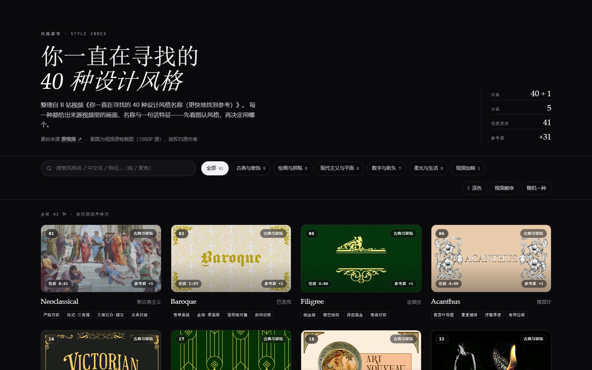
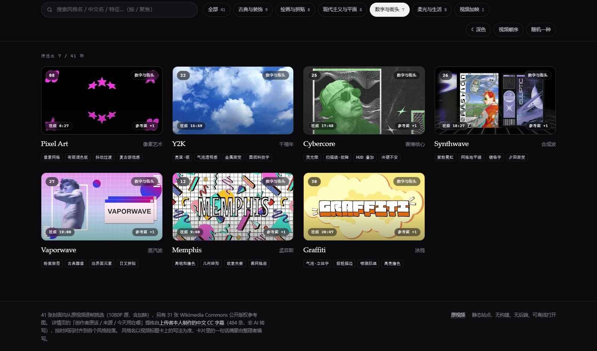
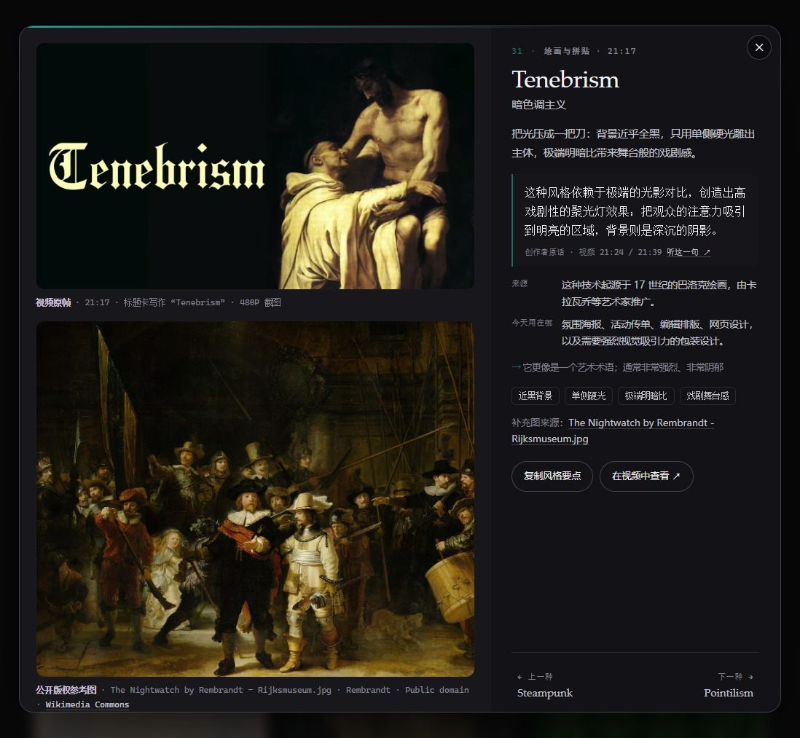

# 40 种设计风格 · 参考图鉴

> **English**: A dependency-free static gallery of 41 design styles — 1080P video stills, subtitle-derived notes, and public-domain reference images for designers picking a look.

[](https://liceses.github.io/design-style-index/)


**先看图认风格，再决定用哪个。** 把 B 站视频[《你一直在寻找的 40 种设计风格名称（更快地找到参考）》](https://www.bilibili.com/video/BV1anQwYZEw2)（`BV1anQwYZEw2`）里的 **40 种正片风格 + 1 种加映**做成 41 张卡片，每种配一帧从视频里逐帧挑出来的画面；点开详情，能看到这种风格长什么样、从哪来、今天用在哪、该拿什么词去搜。

给谁用：手上有个页面 / 海报要定调、却说不清自己要什么风格的人；以及需要一份「风格名 → 参考图」速查表的设计师与内容创作者。


*图 · 线上站点首屏（深色主题）。41 张卡片默认按**视频时间轴**排列——卡片左上角的编号、左下角的时间码、右上角的分组，三者互相自洽。*

---

## 快速开始

**双击 `style-ref/index.html` 就是全部安装步骤**：零依赖、零构建、不需要联网，图片全在本地 `img/` 下。`file://` 协议下所有功能都可用（刻意没用 ES module，就是为了绕开 `file://` 的跨域限制）。

```bash
python -m http.server 8080 --directory style-ref   # 等价做法：起个静态服务器，然后开 http://127.0.0.1:8080/

node dev/check-assets.mjs    # 静态校验：数据 ↔ 文件 ↔ DOM ↔ CSS 互相对账，22 项，不启动浏览器
node dev/verify-live.mjs     # 线上验收：逐 URL 打状态码 + 用线上 data.js 反查 113 张图，12 项
```

打开后你会看到：一个英雄区（统计 + 来源声明）、一条工具条（搜索 / 分组 / 主题 / 排序 / 随机）、以及 41 张卡片。点任意一张进详情。

上面两条校验命令**本次实跑过**（2026-10-07 本机，Node 24.12）：

```
$ node dev/check-assets.mjs     →  22/22 通过   站点合计 13.0 MB（封面 4.5 + 缩略图 1.30 + 补充图 7.0）
$ node dev/verify-live.mjs      →  12/12 通过   线上 41 条风格 / 31 条含补充图 / 113 张图全部 200
```

> `dev/` 里的脚本硬编码了本机绝对路径（`D:/developing/webdesign`），**换目录或换机器要自己改**——见[已知限制](#limits)。

---

## 目录

| 想了解 | 看这里 |
| --- | --- |
| 站里到底有什么、能筛什么 | [这个站有什么](#what) |
| 一张卡片上有哪些字段 | [一张卡片上有什么](#card) |
| **图片和字幕是谁的、能不能商用** | [内容来源与使用限制](#sources) |
| 深浅主题怎么切、颜色从哪来 | [深浅双主题](#theme) |
| 怎么改内容、怎么重出图 | [怎么改内容 / 重新生成](#edit) |
| 怎么发布到线上 | [部署](#deploy) |
| 有什么坑 | [已知限制](#limits) |
| 代码许可状态 | [许可](#license) |

---

<a id="what"></a>
## 这个站有什么

| 能力 | 说明 |
| --- | --- |
| **41 条风格** | 40 种正片 + 1 种加映「Scrapbook 拼贴手账」（视频 `28:35` 处标着 Bonus Style）。标题卡上印什么就写什么，与视频简介时间轴的写法差异记在每条数据的 `videoName` 字段里 |
| **每条的封面都是逐帧挑的** | 视频结构是「标题卡 → 主持人讲解 → 示例图穿插」，真正的示例画面出现在每段**开头 1–4 秒**；从那个窗口里逐帧比对，优先选没有压字、不是主持人镜头、不是转场模糊帧的那一张 |
| **搜索** | 匹配英文名 / 中文名 / 特征词 / 描述；空格分词，**全部命中**才算 |
| **6 个分组** | 古典与装饰 · 绘画与拼贴 · 现代主义与平面 · 数字与街头 · 柔光与生活 · 视频加映 |
| **三态排序** | 点「视频顺序」按钮循环切换：**视频时间轴**（默认）→ 名称 A–Z → 按分组 |
| **详情页** | 大图 + 一句话摘要 + 创作者原话 + 来源 / 今天用在哪 + 特征 + 时间码链接 + 上/下一种 |
| **键盘与分享** | `←` `→` 翻上下一种、`Esc` 关详情、`/` 聚焦搜索；`#slug` 可直接分享，例如 `index.html#vaporwave` |
| **复制风格要点** | 一键把摘要、原话、来源、用途、提示、出处整段复制走 |
| **随机一种** | 从**当前筛选结果**里随机打开一条 |


*图 · 筛到「数字与街头」分组（7 种）。卡片上的「参考图 +1」角标表示这条另有 1 张公开版权补充图；页脚那条来源声明在每个页面底部都可见。*

**编号 = 视频时间轴顺序。** 编号 `n` 是按视频秒数 `t` 重排过的，所以「视频顺序」排序、卡片编号、徽章上的时间码三者一致且单调递增——这条不变量由 `dev/check-assets.mjs` 断言（本次实跑 PASS）。它曾经是错的：早期版本按分组顺序编号，卡片编号并不对应视频时间轴，已修。

---

<a id="card"></a>
## 一张卡片上有什么

每条风格在 `style-ref/data.js` 里是一个对象。**「一句话摘要」和「创作者原话」是两种不同来源的东西，页面上也分开呈现**：

| 字段 | 含义 | 谁写的 |
| --- | --- | --- |
| `n` / `slug` / `en` / `zh` | 视频顺序编号 / 锚点 / 英文名 / 中文名 | 整理者 |
| `group` | 6 个分组之一 | 整理者 |
| `t` / `tc` / `videoUrl` | 视频秒数 / 时间码（如 `21:17`）/ 带 `?t=` 的直达链接 | 整理者定位 |
| `desc` | **一句话摘要**（卡片正面那句） | **整理者编写** |
| `traits` | ≥3 个特征词（卡片底部的胶囊） | 整理者 |
| `say` / `sayAt` | **创作者原话** / 原话在视频里的时间码（如 `21:24 / 21:39`，可点回视频那一句） | **上传者字幕** |
| `origin` | 历史来源与年代 | **上传者字幕** |
| `usage` | 今天用在哪 | **上传者字幕** |
| `tips` | 搜索关键词 / 实操提示 | **上传者字幕** |
| `img` / `thumb` | 视频原帧（1600×900）/ 缩略图（720×406） | 视频原帧 |
| `ref` | 公开版权补充图：`title` / `artist` / `license` / `licenseUrl` / `page` / 尺寸 / 字节数 | Wikimedia Commons |
| `accent` / `accentInk` / `tint` / `tintLight` | 四个派生色（深色主题强调色 / 浅色主题强调色 / 两种主题的图框底色） | 从封面图提取 |
| `videoName` | 视频**标题卡上实际印的字样**（可能和时间轴写法不同） | 视频 |


*图 · 详情页（深色主题，`index.html#tenebrism`）。上半是**视频原帧**（带时间码与标题卡原文），下半是**公开版权参考图**，图注把 `标题 · 作者 · 许可 · 来源` 四件事都摊开——这是本站对 Commons 图的署名方式。*

### 强调色是「从图里长出来的」

每张卡片的强调色用 Pillow 从该风格封面图里**提取主色**。为了照顾两套主题，实际生成四个派生色：`accent`（深色主题用，亮而饱和）、`accentInk`（浅色主题用，同色相压暗但保留源色饱和度性格）、`tint` / `tintLight`（两种主题下卡片图框的底色）。这些都在 `dev/build_site_data.py` 里算，改内容时会一并重算。

---

<a id="sources"></a>
## 内容来源与使用限制

> [!WARNING]
> **这个仓库里混了权利状态完全不同的四类东西。** 视频原帧与中文字幕是**第三方版权作品**，本站只是引用并标注出处；Commons 图各有各的许可；**而本站自己的代码与数据整理没有附任何许可证文件**。
> 要转载或商用，请自行向原作者取得授权。**本仓库没有对这些第三方素材授予任何许可。**

| 素材 | 数量 | 来源 | 权利状态 |
| --- | --- | --- | --- |
| **视频原帧**（封面 + 缩略图） | 41 + 41 | 原视频（英文原片作者来自设计工具 **Kittl**；B 站搬运 UP 主「**咲喜**」） | **第三方版权**。本站仅作风格示意引用，并标注了出处与时间码；若要公开分发，请自行确认授权 |
| **中文 CC 字幕文本及其提炼内容** | 41 条详解（源自 **484 条**字幕） | B 站 UP 主「咲喜」**本人制作**（`lan=zh-Hans`、`ai_type=0`、作者 mid 即 UP 主，**不是 B 站 AI 转写**） | **第三方版权**（翻译作品）。它逐句翻译了英文原片的旁白，详情页的 `say` / `origin` / `usage` / `tips` 四个字段就是从它提炼的 |
| **公开版权参考图** | 31 | Wikimedia Commons | **各自许可**（本站用到 CC0 / 公有领域 / CC BY / CC BY-SA / FAL）。详情页已附 `标题 · 作者 · 许可协议 · 来源链接` |
| `index.html` / `styles.css` / `app.js` / 数据整理 | — | 本仓库 | **未附许可证**（根目录没有 `LICENSE` 文件，GitHub 也未识别到许可证） |

**几点需要说清楚的：**

- **字幕是怎么对齐的。** 不依赖字幕自身的断句，而是用视频简介里的时间轴做段落边界（`dev/segments.json`），把 `[起点+2s, 下个起点)` 之内的句子归给该风格；起点前 4 秒的句子单独列为「衔接」，因为那往往是上一段的收尾话——这样能避免把上一段的总结安到下一段头上。提炼时清理了口误、玩笑与频道推广（原片里的 Kittl 在字幕里被音译成 "Kittle/Kiddle"，提炼时已还原为 Kittl 并剔除相关推广）。
- **摘要 ≠ 原话。** 卡片上那句话是**整理者编写的**；详情页的「创作者原话 / 来源 / 今天用在哪」才是上传者字幕的内容，并带时间码。两者在页面上是分开呈现的。
- **10 个风格故意没有补充图。** 检索到的候选与风格对不上时宁可留空，也不硬凑——例如 `bohemian` 被抓成同名的教堂、`mystical-western` 被抓成「西洋美术馆」、`y2k` 被抓成「Y2K 千年虫计算器」。留空的是：`Bohemian`、`Coquette`、`Y2K`、`Kawaii`、`Japandi`、`Mid Century`、`Mixed Media`、`Mystical Western`、`Utilitarian`、`Scrapbook`。
- **补充图是「名称对得上」的公开素材**，可能与视频里展示的示例不完全一致。

> 更细的来源说明、逐条验证记录、以及制作过程中修掉的真 bug 清单，都在 [`style-ref/README.md`](style-ref/README.md)（221 行）。

---

<a id="theme"></a>
## 深浅双主题


*图 · 同一页面的浅色主题。浅色不是把深色反相，而是另一套暖纸感配色（`#f6f5f2` 底 / 白面板 / 深墨字）。*

- **默认跟随系统**（`prefers-color-scheme`）；点了工具条最左侧那个按钮之后就记住选择（`localStorage: styleref.theme`），不再被系统改回去。
- 首次绘制前就在 `<head>` 里定好 `data-theme`，所以**不会出现先白后黑的闪烁**。
- 图片上的角标为了可读性，在两种主题下都保持深色胶囊。
- 对比度由 `dev/verify-site.mjs` 断言（深浅两套各 3 条）：正文 ≥ 7:1、次级文字 ≥ 4.5:1、辅助文字 ≥ 4:1。**这条是仓库自己的验收记录**（[`style-ref/README.md`](style-ref/README.md) 记为 43/43 通过），本次改写只跑了不启动浏览器的那两条脚本。

---

<a id="edit"></a>
## 怎么改内容 / 重新生成

**内容与图片是分离的，改内容不用碰 HTML。**

```bash
# 1) 改内容源（不是改 data.js —— data.js 是生成产物，文件头写着「请勿手改」）
#    dev/style-master.json    名称 / 中文名 / 分组 / 特征 / 一句话摘要
#    dev/subtitle-facts.json  字幕提炼出来的 say / origin / usage / tips
# 2) 重新生成 data.js（会一并重算主色、四色派生、视频顺序编号）
python dev/build_site_data.py

# 3) 要换某张封面：改 dev/finals.json 里该风格的秒数，然后按秒数重导图
node dev/extract-finals.mjs        # 导出 img/（1600）与 img/thumbs/（720）
```

`dev/` 下的工具链按用途分四类：

| 类别 | 脚本 |
| --- | --- |
| 取素材 | `fetch-style-video.mjs`（未登录取 480P）、`fetch-hd-cdp.mjs`（从**已经开着的**带 `--remote-debugging-port` 的浏览器取登录态请求 1080P；**它自己不开浏览器**）、`fetch-subtitle.mjs`（匿名取字幕，结论是拿不到——B 站只对已登录请求下发字幕地址）、`subtitle-via-cdp.mjs`、`fetch-commons.mjs`（抓 Commons 候选，串行节流 + 指数退避） |
| 抽帧 | `extract-candidates.mjs` / `probe-window.mjs` / `dense.mjs` / `window.mjs` / `fine.mjs`（按段落比例 / 固定偏移 / 固定步长等不同抽法）、`extract-covers.mjs` / `extract-finals.mjs`（导出候选 / 导出最终封面） |
| 校订 | `align-subtitle.mjs`（字幕按时间轴切到 41 个段落，输出 `dev/subtitle/by-style.md`）、`sheets.py` / `review_pd.py`（把候选图拼成带标签的联系表供人工挑选） |
| 验收 | `build_site_data.py`、`check-assets.mjs`（**静态完整性校验，不启动浏览器**——日常改完跑这个）、`verify-site.mjs`（真机交互验收，Edge headless + CDP，43 项）、`verify-live.mjs`（线上验收，12 项）、`cdp-shot.ps1` |

---

<a id="deploy"></a>
## 部署

线上地址：<https://liceses.github.io/design-style-index/>

发布方式是 GitHub Actions 把 `style-ref/` 打包成 Pages 产物（[`.github/workflows/pages.yml`](.github/workflows/pages.yml)），**推送到 `main` 即自动更新**。所以站点文件不必挪到仓库根目录——发布产物的根目录就是 `index.html`，而 `dev/`（工具链与字幕文本）不会被发布出去。

workflow 带 `paths` 过滤：只有 `style-ref/**` 或 workflow 自身变动才触发部署，改 `dev/` 不会白跑一次；需要手动重发时用 `workflow_dispatch`。

> 走 Actions 发布时 GitHub 不做 Jekyll 处理，因此**不需要 `.nojekyll`**。

---

<a id="limits"></a>
## 已知限制

- **`dev/` 工具链事实上只在 Windows + 本机目录下能跑。** 脚本里硬编码了 `D:/developing/webdesign`（14 个脚本）、`D:/applications/ffmpeg/bin/ffmpeg.exe`（8 个）、`C:/Program Files (x86)/Microsoft/Edge/Application/msedge.exe`、`C:/Windows/Fonts/*.ttf`，还 `spawnSync('pwsh', ...)`。换机器需要自行调整。**站点本体不受影响**——它没有任何平台判断，`file://` 下全功能可用。
- **原始视频与中间产物没有入库**（`.gitignore` 排除 `dev/style-video/`、`dev/pd-cand/`、`dev/sheets/`）：1080P 源视频单文件 **207 MB**，超过 GitHub 限制。需要时用 `dev/` 的脚本重新生成。
- **视频原帧里可能带原视频的信息**：有些封面保留了视频自己压上去的风格名（例如 `BAROQUE`、`VICTORIAN`、`ACANTHUS`）。这是视频原本的呈现方式，不是截图失误——这类帧在视频里就是「标题卡」。
- **字幕是中文翻译**，个别专有名词照原样保留了上传者的译法（如把 Kittl 译成 "Kittle"、把 "Mid-century" 译成「中世纪」）。提炼字段时做了还原，但 `say` 字段保留原话风格、只做语句通顺处理。
- **没有后端**，所以没有收藏 / 笔记持久化；要留痕请用 `#slug` 链接。
- **补充图只覆盖 31/41 个风格**，且是「名称对得上」的公开素材，可能与视频里的示例不完全一致。
- **首页统计写「分组 5」，而分组筛选条有 6 个**（多一个「视频加映」）。这是有意为之（`style-ref/app.js` 里显式排除了 `bonus`），不是 bug，这里记一笔免得后来者误判。

---

<a id="license"></a>
## 许可

**本仓库根目录没有 `LICENSE` 文件**，`gh repo view --json licenseInfo` 返回 `null`——GitHub 未识别到任何许可证。因此本文档不放 License 徽章：那等于编造一个并不存在的许可证。

具体到各部分：

| 部分 | 状态 |
| --- | --- |
| `index.html` / `styles.css` / `app.js` / 数据整理 | **未附许可证**。在权利人补上许可证之前，默认保留全部权利 |
| 41 张视频原帧及其缩略图 | 第三方版权，归原视频作者（英文原片作者来自 Kittl，B 站 UP 主「咲喜」搬运并制作字幕）。本站引用时标注了出处与时间码 |
| 中文 CC 字幕文本及其提炼字段 | 第三方版权（翻译作品），归 UP 主「咲喜」 |
| 31 张补充参考图 | Wikimedia Commons，各自许可（CC0 / 公有领域 / CC BY / CC BY-SA / FAL），详情页附署名与协议链接 |

**本仓库未对这些第三方素材授予任何许可。** 若要转载或商用，请自行向原作者取得授权。公开推送此仓库只是为了避免私密仓库的额外配置，不代表放弃上述限制。

---

## 相关

- [`style-ref/README.md`](style-ref/README.md) —— 完整文档：来源、版权、交互、验证记录、制作过程中修掉的真 bug
- 原视频：<https://www.bilibili.com/video/BV1anQwYZEw2>（《你一直在寻找的 40 种设计风格名称（更快地找到参考）》，UP 主「咲喜」）
